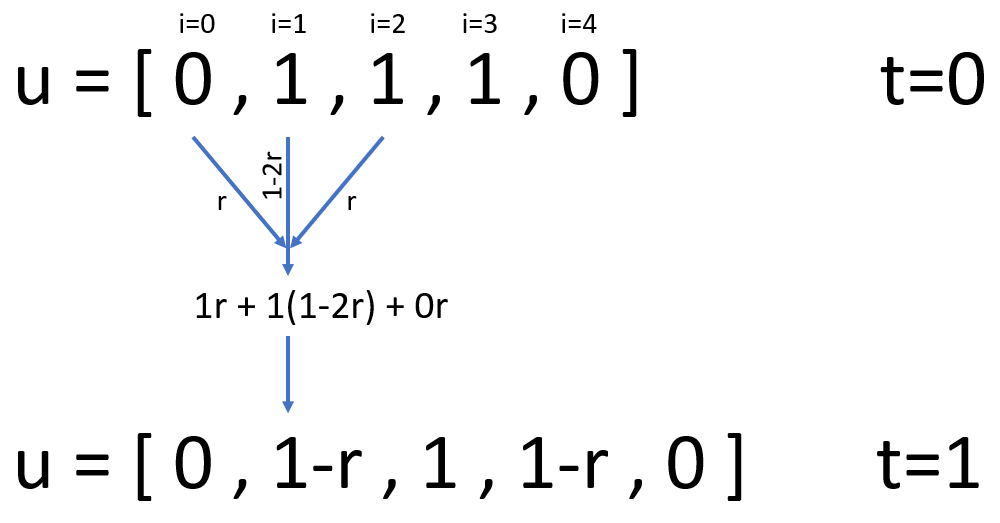

## Introduction to your challenge

You have inherited some buggy code from a previous member of your research group:
it has a unit test but it is currently failing. Your job is to refactor the code
and write some extra tests in order to identify the problem, fix the code and
make it more robust.

The code solves the heat equation, also known as the
["Hello World" of Scientific Computing][heat-equation]. It models transient heat
conduction in a metal rod i.e. it describes the temperature at a distance from
one end of the rod at a given time, according to some initial and boundary
temperatures and the thermal diffusivity of the material:


[heat-equation]: https://github.com/betterscientificsoftware/hello-heat-equation

The function `heat()` in `diffusion.py` attempts to implement a **step-wise
numerical approximation** via a [finite difference
method](https://en.wikipedia.org/wiki/Finite_difference_method):

u_{i}^{t}&plus;ru_{i-1}^{t})

This relates the temperature `u` at a specific location `i` and time point `t`
to the temperature at the previous time point and neighbouring locations. `r` is
defined as follows, where `α` is the thermal diffusivity: 

We approach this problem by representing `u` as a Python list. Elements within
the list correspond to positions along the rod, `i=0` is the first element,
`i=1` is the second and so on. In order to increment `t` we update `u` in a
loop. Each iteration, according to the finite difference equation above, we
calculate values for the new elements of `u`.



The `test_heat()` function in `test_diffusion.py` compares this _approximation_
with the _exact_ (analytical) solution for the boundary conditions (i.e. the
temperature of the end being fixed at zero). The test is correct but failing -
indicating that there is a bug in the code.

## Testing (and fixing!) the code (50 min)

Work by yourself or with a partner on these test-driven development tasks. Don't
hesitate to ask a demonstrator if you get stuck!

> ## Separation of concerns
>
> First we'll refactor the code, increasing its modularity. We'll extract the
> code that performs a single time step into a new function that can be verified
> in isolation via a new unit test:
>
> 1. In `diffusion.py` move the logic that updates `u` within the loop in the
>    `heat()` function to a new top-level function:
>
>    ```python
>    def step(u, dx, dt, alpha):
>        …
>    ```
>
>    _Hint: the loop in `heat()` should now look like this:_
>
>    ```python
>    for _ in range(nt - 1):
>        u = step(u, dx, dt, alpha)
>    ```
>
> 2. Run the existing test to ensure that it executes without any Python errors.
>    It should still fail.
> 3. Add a test for our new `step()` function:
>
>    ```python
>    def test_step():
>        assert step(…) == …
>    ```
>
>    It should call `step()` with suitable values for `u` (the temperatures at
>    time `t`), `dx`, `dt` and `alpha`. It should `assert` that the resulting
>    temperatures (i.e. at time `t+1`) match those suggested by the equation
>    above. Use `approx` if necessary.  \_Hint: `step([0, 1, 1, 0], 0.04, 0.02,
>    0.01)` is a suitable invocation. These values will give `r=0.125`. It will
>    return a list of the form `[0, ?, ?, 0]`. You'll need to calculate the
>    missing values manually using the equation in order to compare the expected
>    and actual values.
>
> 4. Assuming that this test fails, fix it by changing the code in the `step()`
>    function to match the equation - correcting the original bug. Once you've
>    done this all the tests should pass.
>
> > ## Solution 1
> >
> > Your test should look something like this:
> >
> > ```python
> > # test_diffusion.py
> > def test_step():
> >     assert step([0, 1, 1, 0], 0.04, 0.02, 0.01) == [0, 0.875, 0.875, 0]
> > ```
> >
> > Your final (fixed!) `step()` function should look like this. The original
> > error was a result of some over-zealous copy-and-pasting.
> >
> > ```python
> > # diffusion.py
> > def step(u, dx, dt, alpha):
> >     r = alpha * dt / dx ** 2
> >
> >     return (
> >         u[:1]
> >         + [
> >             r * u[i + 1] + (1 - 2 * r) * u[i] + r * u[i - 1]
> >             for i in range(1, len(u) - 1)
> >         ]
> >         + u[-1:]
> >     )
> > ```
> >
> {: .solution}
{: .challenge}

Now we'll add some further tests to ensure the code is more suitable for
publication.

> ## Testing for exceptions
>
> We want the `step()` function to
> [raise](https://docs.python.org/3/tutorial/errors.html#raising-exceptions) an
> [Exception](https://docs.python.org/3/tutorial/errors.html#exceptions) when
> the following [stability condition](https://en.wikipedia.org/wiki/Von_Neumann_stability_analysis)
> _isn't_ met: 
> Add a new test `test_step_unstable`, similar to `test_step` but that invokes
> `step` with an `alpha` equal to `0.1` and expects an `Exception` to be
> raised. Check that this test fails before making it pass by modifying
> `diffusion.py` to raise an `Exception` appropriately.
>
> > ## Solution 2
> >
> > ```python
> > # test_diffusion.py
> > def test_step_unstable():
> >     with pytest.raises(Exception):
> >         step([0, 1, 1, 0], 0.04, 0.02, 0.1)
> >
> > # diffusion.py
> > def step(u, dx, dt, alpha):
> >     r = alpha * dt / dx ** 2
> >
> >     if r > 0.5:
> >         raise Exception
> >
> >     …
> > ```
> >
> {: .solution}
{: .challenge}

> ## Adding parametrisation
>
> Parametrise `test_heat()` to ensure the approximation is valid for some other
> combinations of `L` and `tmax` (ensuring that the stability condition remains
> true).
>
> > ## Solution 3
> >
> > ```python
> > # test_diffusion.py
> > @pytest.mark.parametrize("L,tmax", [(1, 0.5), (2, 0.5), (1, 1)])
> > def test_heat(L, tmax):
> >     nt = 10
> >     nx = 20
> >     alpha = 0.01
> >
> >     …
> > ```
> >
> {: .solution}
>
> After completing these two steps check the coverage of your tests via the Test
> Output panel - it should be 100%.
{: .challenge}

The full, final versions of [diffusion.py](https://github.com/ImperialCollegeLondon/diffusion/blob/develop/diffusion.py)
and [test_diffusion.py](https://github.com/ImperialCollegeLondon/diffusion/blob/develop/test_diffusion.py)
are available on GitHub.

> ## Bonus tasks
>
> - Write a doctest-compatible docstring for `step()` or `heat()`
> - Write at least one test for our currently untested `linspace()` function
>   - _Hint: you may find inspiration in [numpy's test cases][numpy-test-cases],
>     but bear in mind that its [version of linspace][linspace] is more capable
>     than ours._
{: .challenge}

[numpy-test-cases]: https://github.com/numpy/numpy/blob/021163b5e2293286b26d22bdae51305da634e74d/numpy/core/tests/test_function_base.py#L222
[linspace]: https://docs.scipy.org/doc/numpy/reference/generated/numpy.linspace.html


