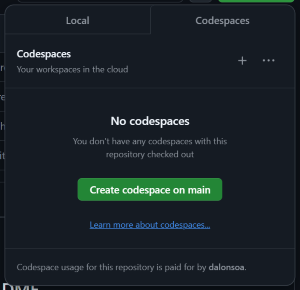
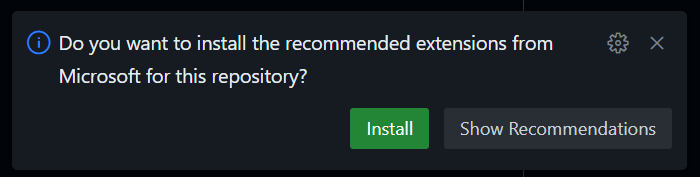
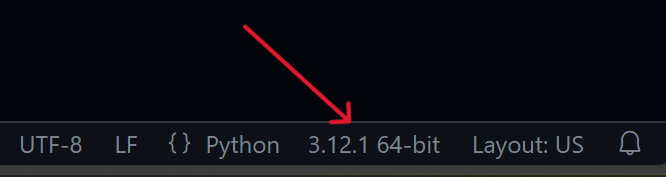
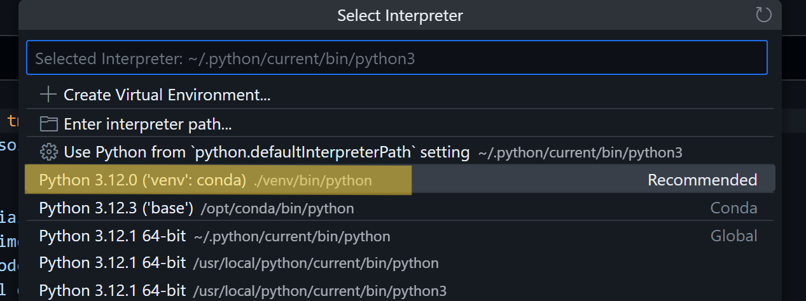

Completing this course requires you to have access to computer with some
software prerequisites installed. This course is currently being delivered
remotely so please make sure you have access to a suitable computer. All
attendees should download install the applications Conda, Visual Studio Code and
Git.

> ## Important!
>
> Make sure that you have the most recent versions of Conda and VSCode. Some
> features used in this lesson will not work with older versions.
{: .callout}

## Conda

Conda is a Python distribution and package manager. We use both features to
provide the version of Python that is used in these materials and to setup
self-contained environments.

You can choose to install the full version of [anaconda][] or the more minimal
[miniconda][]. Either is suitable but make sure to choose the Python 3.*
version. If prompted, choose to install only for your user account and do not
install PyCharm.

[anaconda]: https://docs.anaconda.com/anaconda/install/
[miniconda]: https://docs.conda.io/projects/conda/en/latest/user-guide/install/

To test that the installation was successful follow the instructions for your
operating system below.

### Windows

* From the start menu search for and launch `Anaconda Prompt`.
* In the launched window type `conda env list` and press enter.
* You should see output similar to the below.

```bash
# conda environments:
#
base                  *  C:\Users\ccaveayl\AppData\Local\Continuum\anaconda3\
```

### Mac and Linux

* Launch a terminal
* In the launched window type `conda env list` and press enter.
* You should see output similar to the below.

```bash
# conda environments:
#
base                  *  /home/ccaveayl/anaconda3
```

## Visual Studio Code

This course will use Visual Studio (VS) Code as an integrated development
environment (IDE). You may already have a preferred IDE that you use regularly,
however we strongly suggest that you use VS Code for this course and afterwards
replicate the setup as you choose. *If you already have VS Code installed please
make sure it is updated to the latest version.*

To install VS Code follow the instructions
[here](https://code.visualstudio.com).

You should then be able to launch VS Code and see something like:


## Other languages

This course will focus on Python, but **the general principles and recommendations are
equally applicable to any other programming language used in research**. Throughout the
episodes, we will include indications on what are the equivalent tools and approaches in
other programming languages, such that interested readers can check what they should use 
in those cases.

Some useful links to integrate the Fortran and C++ tools that will be mentioned during the
course can be found in:

- **C++**: [C/C++ VSCode extension](https://marketplace.visualstudio.com/items?itemName=ms-vscode.cpptools), including a [full tutorial](https://code.visualstudio.com/docs/languages/cpp) on how to set VSCode to work with C++., but for Windows it might be easier to just use Visual Studio.
- **Fortran**: [VSCode Modern Fortran extension](https://fortran-lang.github.io/vscode-fortran-support/), which integrates with the linters and formatters and the Fortran Language Server [fortls](https://fortls.fortran-lang.org/).


## Codespaces

This course is designed to teach you several fundamental concepts on software engineering
good practices as well as helping you to setup your computer so you can keep developing your
own code following these principles once the course is over. However, there are occasions
when, for a variety of reasons, installing and running the above tools and those described
in the course just does not work as expected.

Rather than holding your learning or that of your colleagues, if after a few minutes
trying to diagnose and solve the problem things are not working, you can run the exercises
of this course in [GitHub Codespaces](https://github.com/features/codespaces). Once the
course is over, please [book a Code Surgery with us](https://www.imperial.ac.uk/admin-services/ict/self-service/research-support/rcs/service-offering/research-software-engineering/code-surgeries/)
and we will help you to fix whatever issue you were facing with your computer. 

To use Codespaces with the course examples:

1. Go to the GitHub repository containing the code for the example.
2. Click in the green `Code` button, select the `Codespaces` tab and click in `Create codespace on main`
A new tab will open in your brlowser, launching VSCode in there, creating a suitable virtual
environment and installing the dependencies.



3. At some point, a pop-up message will ask if you want to install the recommended extensions. 
Say 'yes' and wait until everything is installed. 



4. Now, you need to select the new python environment that has been installed. Open any
python file and click in the Python version number label at the bottom, right corner.



5. This will display at the top of the window a list of suitable Python environment. Select
the recommended one, which should be the one that says `('venv')` or `('venv': conda)`.



And that is all! You should be able to use this VSCode within the Codespace the same way you
use it locally. You can close the tab and go back to the Codespace from the GitHub repo any
time you want, and its state will be preserved for some time, but afterwards it will be
shut down and any information there will be lost.


